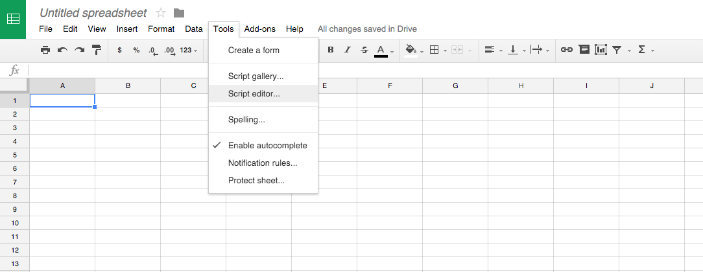
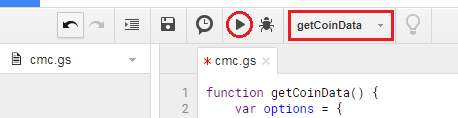

# cmc-google-sheet
Script for loading data from coinmarketcap.com to google sheet.

How to set-up:
1. Create new Google sheet file.
2. Rename the sheet for data to *cryptodata*.
3. Run Tools - Script editor...

4. Insert the code from cmc.gs file.
5. Change the line: `'X-CMC_PRO_API_KEY': 'INSERT-YOUR-FREE-API-KEY-HERE'`
6. Select `getCoinData` function and test run.

7. Check your *cryptodata* sheet.

Use within your sheet by creating button with script.

Based on script from https://qiita.com/t_inoue0204/items/30cf5bbc0cd74208409c
